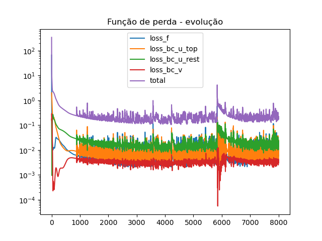
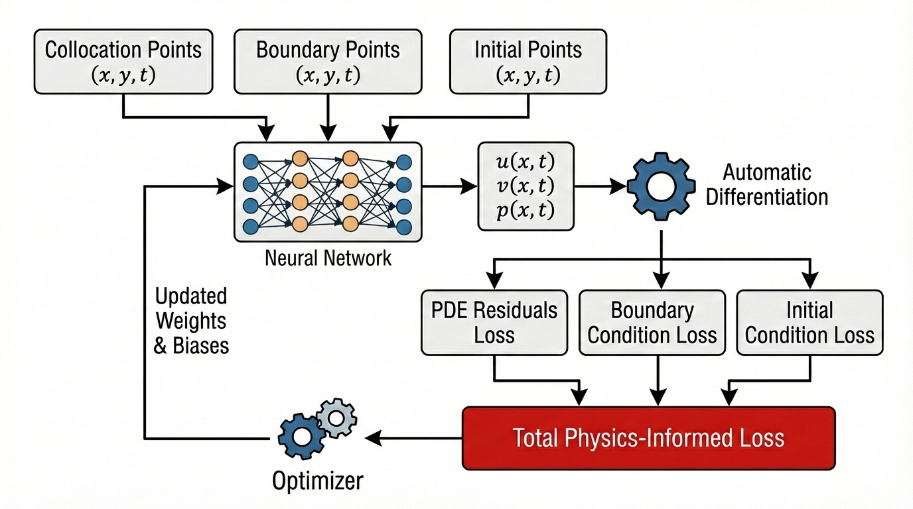

# FerroPINN

## 🎯 Overview and objectives
This repository contains Python codes that simulate the lid-driven cavity flow using Physics-Informed Neural Networks (PINNs). The main library employed is [PyTorch](https://pypi.org/project/torch/)
, which provides the core tools required to implement and train PINN models.

The primary objective of this project is to investigate the efficiency of PINNs, starting with a simple validation case (the lid-driven cavity) and subsequently advancing to a more complex physical problem: the thermoconvection of magnetic fluids under an applied magnetic field.

This repository is associated with the **Laboratório de Computação Científica em Escoamentos Complexos (LCEC-UNB)**.

## 📁 Repository structure

This repository have the following structure

```
FerroPINN/
├── README.md
├── LICENSE
├── .gitignore
├── src/
├── docs/
└── examples/
```

- `src/` → project source codes  
- `examples/` → test cases and simulation examples  
- `docs/` → documentation, articles, and technical notes

## 📝 Codes

### cavidade_cisalhante.py

This script implements a baseline PINN solver for the two-dimensional lid-driven cavity flow, running a single simulation per execution. Training is performed using the Adam optimizer, with an optional switch to L-BFGS after 5000 epochs, making it suitable for validation studies and direct comparison with automated or optimized implementations.

### cavidade_cisalhante_sweep.py

This script extends the baseline PINN solver for the two-dimensional lid-driven cavity flow by enabling multiple simulations within a single execution. It allows the user to define a set of simulations with different physical parameters, neural network architectures, and loss weights, which are then executed sequentially.

The script is designed for parameter sweeps and comparative studies, automatically organizing the results of each simulation into structured directories according to the Reynolds number. Unlike the baseline version, this implementation prioritizes automation and reproducibility over interactivity, making it suitable for systematic numerical experiments.


## 📊 Outputs examples

<p align="center">
  <br>
  <em>Figure 1 – Horizontal velocity field (u) for the lid-driven cavity flow.</em>
</p>

<p align="center">
  <br>
  <em>Figure 2 – Streamlines of the lid-driven cavity flow, highlighting the primary recirculation region.</em>
</p>

<p align="center">
  <br>
  <em>Figure 3 – Evolution of the PINN loss function during training for the lid-driven cavity flow.</em>
</p>

The code generates an output file named `parametros.json`, which contains all the
hyperparameters used in the simulation:

```json
{
    "Re": 10.0,
    "N_int": 15000,
    "N_bc": 800,
    "epochs": 8000,
    "layers": 10,
    "neurons": 30,
    "activation": "Tanh",
    "LHS": true,
    "Troca_Opt_5000": false,
    "Normalizacao": true,
    "w_f": 5.0,
    "w_u_top": 5.0,
    "w_u_rest": 5.0,
    "w_v": 5.0
}
```

and an output file named `info_execucao.json` with the following informations

```json
{
    "tempo_total_segundos": 7699.32,
    "cpu": "x86_64",
    "arquitetura": "x86_64",
    "sistema": "Linux 6.14.0-27-generic",
    "cpu_cores_fisicos": 16,
    "cpu_cores_logicos": 32,
    "memoria_total_GB": 67.34,
    "gpu_disponivel": false,
    "nome_gpu": "Nenhuma"
}
```
## Required packages

### Python standard library
- os
- json
- time
- platform
- datetime

### Third-party packages
- torch
- numpy
- matplotlib
- pyvista
- scikit-learn
- psutil

## 🚀 Execution

After all the packages are installed, to run the simulation just use the command `python3 cavidade_cisalhante.py` in a terminal.

## 🧪 Methodology / Mathematical Models
In the context of fluid dynamics simulations, Physics-Informed Neural Networks (PINNs) emerge as a
powerful alternative to traditional discrete numerical methods commonly used by engineers. Introduced firstly
by the work of [ 1], PINNs are neural networks that incorporate the governing differential equations directly
into their learning process, serving as a physical constraint or regularizer for the predicted results.
While conventional neural networks rely solely on training data to adjust their outputs, PINNs go a step
further by embedding the physical laws themselves into the optimization process. This makes them a valuable
tool in computational fluid dynamics (CFD), as they can produce physically consistent solutions even with
limited training data.
Unlike traditional methods, PINNs do not require a computational mesh. Instead, they minimize the
residuals of the governing equations and can be trained with only a small number of known boundary and
initial conditions

A physics-informed neural network have the following structure:

<p align="center">
  <br>
  <em>Figure 4 – Structure of a PINN.</em>
</p>

The neural network consists of the following main components, as indicated in the figure above:

1. **Inputs (\(x, y, t\))**  
   The network receives spatial and temporal coordinates as inputs.

2. **Neural Network**  
   Acts as a universal function approximator for the physical fields of interest, such as velocity (\(u, v\)) and pressure (\(p\)).

3. **Automatic Differentiation (AD)**  
   This is the *core* of a PINN. It enables the computation of partial derivatives of the network outputs with respect to the inputs without requiring a numerical grid (mesh).

4. **Loss Function**  
   The loss function is decomposed into three main components:
   - **PDE Residuals**: Enforce the governing physical laws (differential equations) at the collocation points.
   - **Boundary Loss**: Enforce the boundary conditions of the problem.
   - **Initial Loss**: Enforce the initial conditions.

5. **Optimizer**  
   Updates the network weights to minimize the combined physics-informed loss.

## 👥 Authorship and Supervision
- **Main author:** André de Oliveira Brandão (2026)
- **Supervisor:** Prof. Rafael Gabler Gontijo  
- **Laboratory:** [LCEC-UNB](https://github.com/LCEC-UNB)

## 📜 License
Specify the license used (e.g., MIT).

## 📚 References
[1] Maziar Raissi, Paris Perdikaris, and George Karniadakis. *Physics-informed deep learning (Part I): Data-driven solutions of nonlinear partial differential equations*, November 2017.

[2] Carlos Marchi, Roberta Suero, and Luciano Araki. *The lid-driven square cavity flow: Numerical solution with a 1024 × 1024 grid*. Journal of the Brazilian Society of Mechanical Sciences and Engineering, 31, July 2009.

## 👥 Contact
**Coordinator:** [Prof. Rafael Gabler Gontijo](http://www.rafaelgabler.com.br)  
**Organization:** [LCEC-UNB on GitHub](https://github.com/LCEC-UNB)
